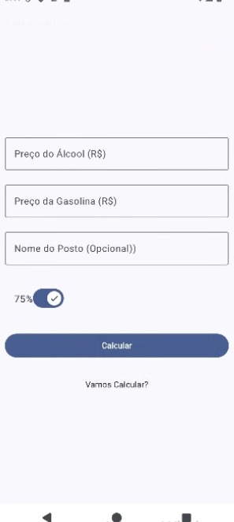
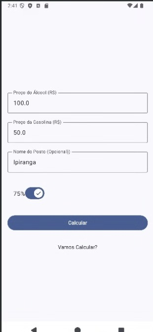
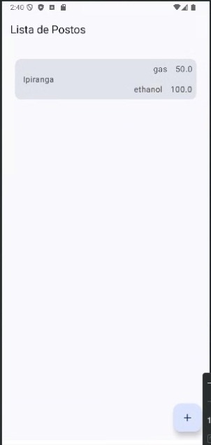
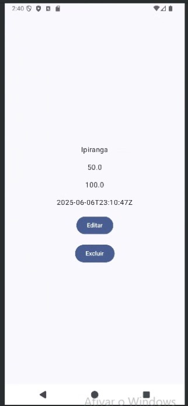

# Álcool ou Gasolina 🚗

> Aplicativo Android para auxiliar o usuário na escolha mais econômica entre álcool e gasolina com base nos valores informados.

## 📋 Sumário

- [Sobre o Projeto](#sobre-o-projeto)
- [Equipe](#equipe)
- [Disciplina e Curso](#disciplina-e-curso)
- [Funcionalidades](#funcionalidades)
- [Tecnologias Utilizadas](#tecnologias-utilizadas)
- [Screenshots](#screenshots)
- [Como Executar](#como-executar)
- [Link do Repositório](#link-do-repositório)
- [Licença](#licença)
- [Contato](#contato)

---

## Sobre o Projeto
Este projeto foi desenvolvido como atividade prática (AT03) da disciplina **Programação para Dispositivos Móveis** do curso de **Sistemas e Mídias Digitais**. O aplicativo permite que o usuário cadastre preços de postos de combustível e, com base em um percentual de rentabilidade (definido pelo usuário), calcule se é mais vantajoso abastecer com álcool ou gasolina.

## Equipe
- **Fátima Letícia Brito Araújo** (RA: 539984)
- **Thainara Miranda da Silva** (RA: 545356)
- **Pedro Lucas de Souza Ribeiro** (RA: 539896)

## Disciplina e Curso
- **Disciplina:** SMD - Programação para Dispositivos Móveis
- **Professor:** Windson Viana de Carvalho
- **Curso:** Bacharelado em Sistemas e Mídias Digitais — Instituto UFC Virtual (UFC)

## Funcionalidades
- Cálculo de custo-benefício entre álcool e gasolina, usando percentual configurável (ex.: 70% ou 75%).
- Cadastro de postos de combustível com nome, preço do álcool e preço da gasolina.
- Listagem de postos com operações de **CRUD** (Criar, Ler, Atualizar e Excluir).
- Interface com tema claro e escuro adaptável.
- Ícone personalizado do aplicativo.
- Persistência de preferências de cálculo (percentual) durante o ciclo de vida da Activity.

## Tecnologias Utilizadas
- **Linguagem:** Kotlin (ou Java)
- **IDE:** Android Studio
- **SDK:** Android SDK
- **Persistência:** Room ou SharedPreferences
- **Gerenciamento de Layouts:** XML

## Screenshots

> **Tela Inicial**


> **Cadastro de Posto**


> **Resultado do Cálculo**


> **Lista de Postos**


> **Posto aberto**


## Como Executar
1. **Clone** o repositório:
   ```bash
   git clone https://github.com/P-Lucas-S/AlcoolOuGasolina.git
